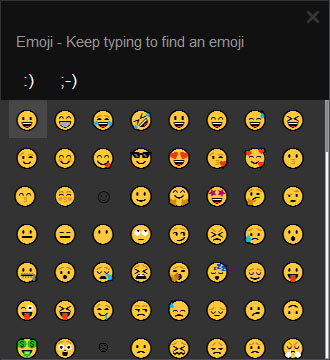

# emoji-picker
Microsoft Windows Emoji Picker clone  

 

## Build

    cd emoji-picker
    mkdir build && cd build
    cmake ../
    cmake --build .

### Windows

if `cmake ../` throws `compiler not found` error, try:  

    rm CMakeCache.txt
    cmake -G"Unix Makefiles" ../

Qt DLLs required in PATH or application root:  

    platforms/qwindows.dll
    Qt5Core.dll
    Qt5Gui.dll
    Qt5Widgets.dll

Qt specifically looks for Windows platform plugin (qwindows.dll) inside `platforms` folder  
